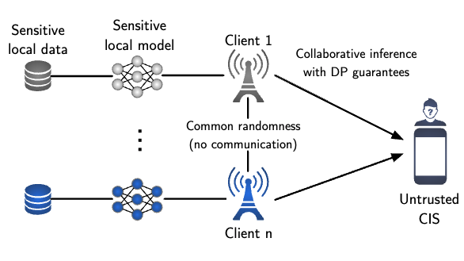
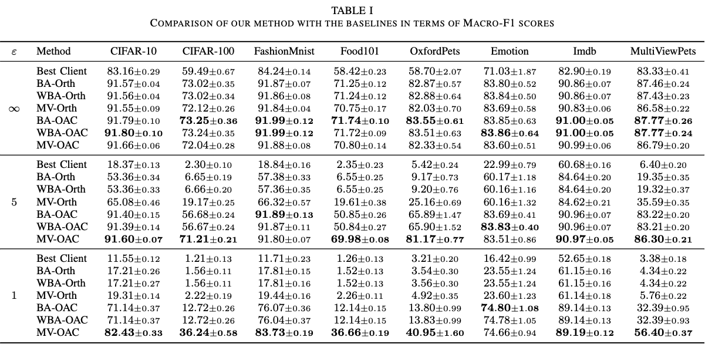

# Private Collaborative Edge Inference via Over-the-Air Computation (TMLCN) [\[arXiv\]](https://arxiv.org/abs/2407.21151) [\[IEEE\]](https://ieeexplore.ieee.org/abstract/document/10829586)

This repository contains the implementation of the paper "Private Collaborative Edge Inference via Over-the-Air Computation".



## Citation
Please cite the paper if this code or paper has been useful to you:
```
@article{yilmaz2025private,
  title={Private Collaborative Edge Inference via Over-the-Air Computation},
  author={Yilmaz, Selim F and Has{\i}rc{\i}o, Burak and Qiao, Li and G{\"u}nd{\"u}z, Deniz and others},
  journal={IEEE Transactions on Machine Learning in Communications and Networking},
  year={2025},
  publisher={IEEE}
}
```

## Abstract
We consider collaborative inference at the wireless edge, where each client's model is trained independently on its local dataset. Clients are queried in parallel to make an accurate decision collaboratively. In addition to maximizing the inference accuracy, we also want to ensure the privacy of local models. To this end, we leverage the superposition property of the multiple access channel to implement bandwidth-efficient multi-user inference methods. We propose different methods for ensemble and multi-view classification that exploit over-the-air computation (OAC). We show that these schemes perform better than their orthogonal counterparts with statistically significant differences while using fewer resources and providing privacy guarantees. We also provide experimental results verifying the benefits of the proposed OAC approach to multi-user inference, and perform an ablation study to demonstrate the effectiveness of our design choices. We share the source code of the framework publicly on Github to facilitate further research and reproducibility.

## Installation
1. Install conda and torch manually (recommended).
2. Run `pip install -r requirements.txt`.

## Running
1. Train and cache the device models.
2. Generate figures, tables, or run raw experiments.

## Training CV Models
```sh
python train.py --data <data_name> --num_repeats 10 --num_devices 20 --num_epochs 50
```
- `<data_name>` can be `cifar10`, `fashionmnist`, `mnist`, `cifar100`, `food101`, `stanfordcars`, `dtd`, `country211`, `flowers102`, `oxford3tpets`, `multiview_oxford3tpet`

## Training NLP Models
```sh
python nlp_train.py --data <data_name> --num_repeats 10 --num_devices 20
```
- `<data_name>` can be `yelp_review_full`, `yelp_polarity`, `imdb`, `emotion`.

## Running an Experiment
- See the bottom of `main.py`.

## Generating TeX Code for the Comparison Table
To generate the TeX code for the comparison table, run the following script:
```sh
python figure_comparison_table.py
```

## Generating TeX Code for the Varying Conditions pgfplot
To generate the TeX code for varying conditions using pgfplot, run the following script:
```sh
python figure_conditions.py
```

## Generating TeX Code for Privacy Quantities
To generate the TeX code for privacy quantities, run the following script:
```sh
python figure_privacy_quantities.py
```

## Generating TeX Code for Projection Ablation
To generate the TeX code for projection ablation, run the following script:
```sh
python figure_projection_ablation.py
```

## Generating TeX Code for Number of Users Ablation
To generate the TeX code for the number of users ablation, run the following script:
```sh
python figure_numusers_ablation.py
```

## Generating TeX Code for Nemenyi Test
To generate the TeX code for the Nemenyi test, run the following script:
```sh
python nemenyi/nemenyi.py figures/comparison_private.csv figures/figure_nemenyi_private.tex --h
python nemenyi/nemenyi.py figures/comparison_non_private.csv figures/figure_nemenyi_non_private.tex --h
python nemenyi/nemenyi.py figures/comparison_weak_private.csv figures/figure_nemenyi_weak_private.tex --h
```

## Generating All Figures
You can generate all figures by running the following script:
```sh
sh all_figures.sh
```

## Results

